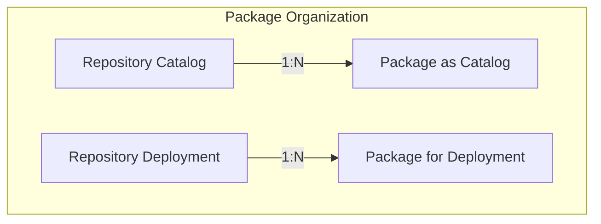

# Concepts

As the name suggests, the `pkgserver` manages `packages`. Fundamentally, a `package` is a set of Kubernetes Resource Model ([KRM][KRM]) resources in [YAML][YAML] format. These resources may include artifacts of software components, configuration, or a combination thereof. By leveraging [KRM][KRM], `pkgserver` provides a flexible and extensible framework for defining and managing complex systems, through a well defined API framework.

To facilitate the organization of `packages`, the `pkgserver` leverages `repositories` to manage `packages`. Within this framework, `pkgserver` distinguishes between two primary types of `repositories`: deployment/catalog `repositories`.

Catalog `repositories`, also known as blueprint `repositories`, serve as templates for software components and configurations.`Packages` in these `repositories` define the structure and composition of the desired [KRM][KRM] resources, providing a standardized framework for deployment.

On the other hand, deployment `repositories` holds `packages` with actual artifacts necessary for deployment, including software components and configuration artifacts. These `packages` contain the tangible elements required to instantiate the deployment artifacts.

Central to the functionality of `pkgserver` is its robust lifecycle management system for packages. This system encompasses essential operations such as discovery, creation, reading, updating, and deletion of `packages`, commonly referred to as CRUD operations.

Additionally, `pkgserver` offers comprehensive versioning capabilities, allowing users to track and manage changes to packages over time. This ensures traceability and facilitates the implementation of controlled release processes.

## PkgServer Resources

PkgServer manages the following resources:

- Repositories: A `repository` is a way to organize and manage `packages`. The `pkgserver` distinguishes between two primary types of `repositories`: deployment repositories and catalog/blueprint repositories.

- PackageRevisions: A specific revision of a `package` managed by the `pkgserver` in one of the registered `repositories`. This resource represents a metadata view of a specific `package` revision.

- PackageRevisionResources: this resource represents the contents of a package revision ([KRM][KRM] resources contained in the package).

!!!note "`PackageRevisions` and `PackageRevisionResources` represent different views of the same underlying `package`. `PackageRevisions` represents the `package` metadata, and `PackageRevisionResources` represents the `package` content."

[KRM]: https://github.com/kubernetes/design-proposals-archive/blob/main/architecture/resource-management.md
[YAML]: https://en.wikipedia.org/wiki/YAML