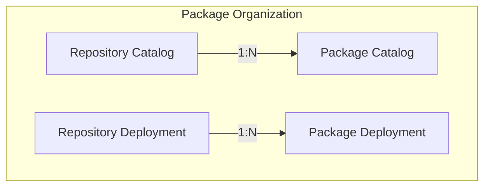

# Concepts

As the name suggests, the `pkgserver` manages `packages`. Fundamentally, a `package` is a set of Kubernetes Resource Model ([KRM][KRM]) resources in [YAML][YAML] format. These resources may include artifacts of software components, configuration artifacts, or a combination thereof. By leveraging [KRM][KRM], pkgserver provides a flexible and extensible framework for defining and managing complex software systems, through a well defined API framework.

To facilitate the organization of packages, the `pkgserver` leverages repositories to manage packages. Within this framework, `pkgserver` distinguishes between two primary types of `packages`: blueprint packages and deployment packages.

Blueprint `packages`, also known as catalog `packages`, serve as templates for software components and configurations. These `packages` define the structure and composition of the desired [KRM][KRM] resources, providing a standardized framework for deployment.

On the other hand, deployment `packages` encapsulate the actual artifacts necessary for deployment, including software components and configuration artifacts. These `packages` contain the tangible elements required to instantiate the blueprint defined by catalog packages.

Central to the functionality of `pkgserver` is its robust lifecycle management system for packages. This system encompasses essential operations such as discovery, creation, reading, updating, and deletion of `packages`, commonly referred to as CRUD operations.

Additionally, `pkgserver` offers comprehensive versioning capabilities, allowing users to track and manage changes to packages over time. This ensures traceability and facilitates the implementation of controlled release processes.

[KRM]: https://github.com/kubernetes/design-proposals-archive/blob/main/architecture/resource-management.md
[YAML]: https://en.wikipedia.org/wiki/YAML