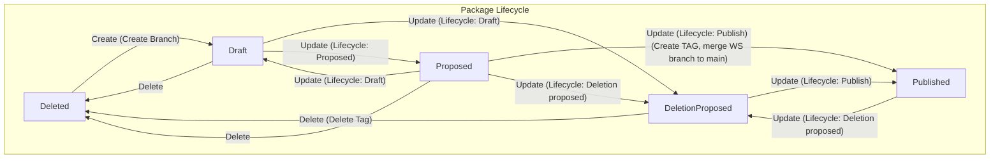

# Package

A `package` represents a collection of [KRM][KRM] resources, organized within a repository and utilizing `YAML` as the file format. These resources, defined in the [Kubernetes Resource Model][KRM], encapsulate configurations, definitions, and metadata necessary to deploy and manage specific functionalities or components within a system. Each `package` is structured to encapsulate related resources, ensuring modularity, portability, and ease of management in various environments. A `package` is contained within a directory of a repsoitory.

Practically a package can be used in various ways (e.g. a certManager package would be a package to ), Configuration artifacts

## PackageRevision

A `package` in the `pkgserver` is represented through a `PackageRevision` KRM resource in the Kubernetes API server. 

### Identification

A `PackageRevision` is uniquely identified by the following parameters:

**Target**: Specifies the deployment target where the package will be deployed.

**Repository**: Indicates the repository housing the package.

**Realm**: Represents a logical grouping or domain name that associates related packages together.

**Package**: Denotes the name of the package.

**Workspace**: Specifies the working environment or branch where the package is being edited.

**Revision**: Signifies a unique identifier for a specific revision of the package. This parameter becomes relevant once the package is published.

### Lifecycle

A `PackageRevision` defines the revision of a package and is managed through a state machine. A `PackageRevision` can exist in the following states within the state machine:

**Draft**: The initial state of a package revision. In this state, the `package revision` is actively being developed and is not yet ready for publication.
    When using a Git Repository, the `package` is contained within a specific workspace branch representing the package revision.

**Proposed**: Transitioning from the Draft state, a `package revision` enters the Proposed state when it is submitted for review and consideration for publication. This is an administrative action without influence on the revision backend.

**Published**: Once approved, a `package revision` moves into the Published state, indicating that it is publicly available for consumption. At this stage, the `package` receives a specific `package revision` identifier that uniquely identifies the package.
    When using a Git Repository, the package is merged into the main branch and tagged with a specific `package revision` tag that uniquely identifies the package.

**Deletion Proposed**: In certain circumstances, a `package revision` may be marked for deletion. It enters the Deletion Proposed state pending approval for removal. This is an administrative action without influence on the revision backend.

**Deleted**: The final state of a `package revision`, indicating that it has been removed from the system and is no longer accessible. If a `package revisio`n ever had a `package revision` identifier, the tag will be deleted when it transitions to the Deleted state.

[KRM]: https://github.com/kubernetes/design-proposals-archive/blob/main/architecture/resource-management.md